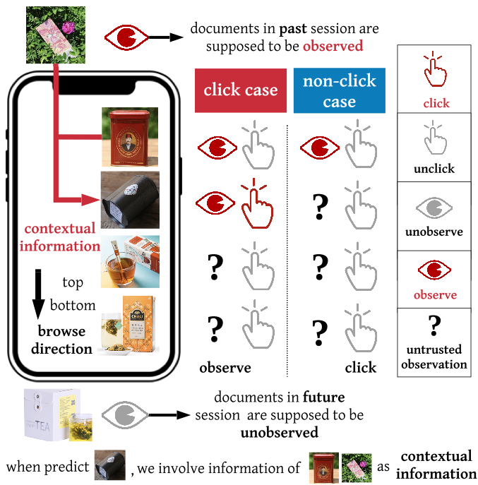

# Deep Recurrent Survival Ranking (DRSR)
<p align="center">
  
  <br />
  <br />
</p>
This is a `tensorflow` implementation of DRSA model. This is the experiment code in the following work:
> A Deep Survival Model for Unbiased Ranking </br>
Jiarui Jin, Yuchen Fang, Weinan Zhang, Kan Ren, Guorui Zhou, Jian Xu, Yong Yu, Jun Wang, Xiaoqiang Zhu, Kun Gai. </br>
[SIGIR 2020 Oral](https://arxiv.org/pdf/2004.14714.pdf)

### Prerequisites
- Python 3

### References
If you find this work helpful in your research, please consider citing the following paper. The bibtex are listed below:
```bibtex
@inproceedings{jin2020deep,
  title={A deep recurrent survival model for unbiased ranking},
  author={Jin, Jiarui and Fang, Yuchen and Zhang, Weinan and Ren, Kan and Zhou, Guorui and Xu, Jian and Yu, Yong and Wang, Jun and Zhu, Xiaoqiang and Gai, Kun},
  booktitle={Proceedings of the 43rd International ACM SIGIR Conference on Research and Development in Information Retrieval},
  pages={29--38},
  year={2020}
}
```
